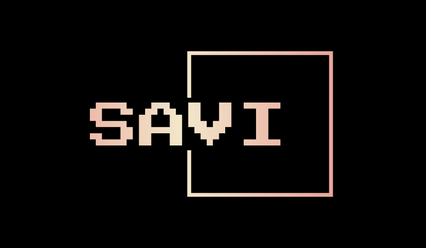
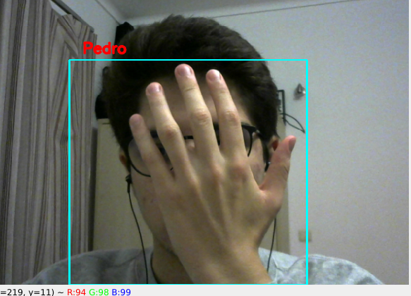

<!-- Improved compatibility of back to top link: See: https://github.com/othneildrew/Best-README-Template/pull/73 -->
<a name="readme-top"></a>
<!--
*** Thanks for checking out the Best-README-Template. If you have a suggestion
*** that would make this better, please fork the repo and create a pull request
*** or simply open an issue with the tag "enhancement".
*** Don't forget to give the project a star!
*** Thanks again! Now go create something AMAZING! :D
-->


<!-- PROJECT SHIELDS -->
<!--
*** I'm using markdown "reference style" links for readability.
*** Reference links are enclosed in brackets [ ] instead of parentheses ( ).
*** See the bottom of this document for the declaration of the reference variables
*** for contributors-url, forks-url, etc. This is an optional, concise syntax you may use.
*** https://www.markdownguide.org/basic-syntax/#reference-style-links
-->
<div align="center">

[![Contributors][contributors-shield]][contributors-url]


<!-- PROJECT LOGO -->
<br />

  <a href="https://github.com/brunofavs/SAVI_TP1/graphs/">
    
  </a>

<h3 align="center">Trabalho Prático 1</h3>

<h2><b> Repository Owner: Bruno Silva 98374
<br>Collaborators: Alexandre Carola 98365 & Pedro Martins 103800</b></h2>

  <p align="center">
    This repository was created for evaluation at Industrial Vision Advanced Systems "SAVI 23-24 Trabalho prático 1".
    <br />
    <!-- <a href="https://github.com/brunofavs/SAVI_TP1"><strong>Explore the Wiki »</strong></a> -->
    <br >
    <a href="https://github.com/brunofavs/SAVI_TP1/issues"> <u>Make Suggestion</u> </a>
  </p>
</div>
<br>


<!-- TABLE OF CONTENTS -->
<details>
  <summary>Table of Contents</summary>
  <ol>
    <li>
      <a href="#about-the-project">About The Project</a>
    </li>
     <li>
      <a href="#Objectives">Objectives</a>
    </li>
    <li>
      <a href="#getting-started">Getting Started</a>
      <ul>
        <li><a href="#Setup">Setup</a></li>
      </ul>
    </li>
    <li><a href="#usage">Usage</a></li>
    <li><a href="#contact">Contact</a></li>
    <li><a href="#acknowledgments">Acknowledgments</a></li>
  </ol>
</details>
<br>


<!-- ABOUT THE PROJECT -->
## About The Project
<div align="center">

</div>
<br>

This assignment was developed for Advanced Systems of Industrial Vision. It is a face recognition with tracking program of multiple people simultaneously, utilizing Python's OpenCV. Some features of a database and an interface, human-machine (using both visual and audio communication) were also implemented.

<p align="right">(<a href="#readme-top">back to top</a>)</p>


<!-- ### Built With

* [![Next][Next.js]][Next-url]
* [![React][React.js]][React-url]
* [![Vue][Vue.js]][Vue-url]
* [![Angular][Angular.io]][Angular-url]
* [![Svelte][Svelte.dev]][Svelte-url]
* [![Laravel][Laravel.com]][Laravel-url]
* [![Bootstrap][Bootstrap.com]][Bootstrap-url]
* [![JQuery][JQuery.com]][JQuery-url]

<p align="right">(<a href="#readme-top">back to top</a>)</p> -->


<!-- Objectives -->
## Objectives

This Python program is meant to execute an intelligent system that receives a webcam stream coming from the computer and searches to fulfill the following topics:

- Detect human faces everytime someone approaches the camera;
- Detect multiple faces simultaneously, using either a pre-recorded database or a consistently updated one that starts it's training since the first start;
- Visualize the realtime database thats being used;
- Identify known detected faces, and ask about unknown ones;
- Greets known faces with 'Hello', followed by the person's name, and asks about the unknown one's name;
- Tracks the known detected faces even if they're unrecognizable. 
<br>
<br>


<!-- GETTING STARTED -->
## Getting Started

This is a Python file, so it should be ran in a dedicated terminal running main.py, which is the file that runs the entire program, it can be found under /src directory.

```
./main.py
```


## Setup
<h3><b>Libraries</b></h3>

To run the program, the following libraries should be installed:
```
sudo apt install python3 python3-tk
sudo apt install python3-pip
pip install pygame
pip install gtts
pip install opencv-python
pip install imutils
pip install numpy
```


<p align="right">(<a href="#readme-top">back to top</a>)</p>

<!-- USAGE EXAMPLES -->
## Usage

### How to use it


Run main.py:
- Show your beautiful face to the camera;


- When prompted to, write your name and press save or hit Enter, it shall now detect your face, identify it, and track it even when you get obstructed by something or leave the camera FOV and come out on the opposite side;

<br>
<br>
<div align="center">

</div>
<div align="center">Prompt to save your name (click save or hit Enter)</div>

<br>
<br>
<div align="center">

</div>
<div align="center">Started recognizing and tracking the face</div>

<br>
<br>
<br>
<br>

<div align="center">

</div>

<div align="center">Disappearing from one side and appearing on the other </div>

<br>
<br>
<br>
<br>
<div align="center">

</div>
<div align="center">Tracking the face even when obstructed</div>
<br>
<br>

- Show other faces and repeat.


<br>

Arguments when running main.py:
- -c (defines which Haar Cascade it is used for detection);
- -t (defines which tracking method is going to be used).
- -v (prints debugging information)
<br>
<br>

***
### How it works
- The program starts untrained, but trains itself and starts tracking as soon as it detects a face.
- Detections showed in green, and tracking in blue.
- When detecting faces, it has low confidence of them being unknown ones, to avoid false detection of already known faces.
- If the detection occurs close to a previous tracker, it considers it to be the same face that the tracker is following. 
- When tracking, as soon as that face is detected, it sends a new training for the detections of that person.
- When tracking fails, it gets ready to be reset. If it gets reactivated ...
- If a program's detection has confidence of it being a new face, and it doesn't match a tracker, considers it a new unknown face. Trains a new detection model, as a new label.
- When a new face is detected, a yaml file is created with the name of that person plus it's image used for training
- Skips all false positives.
- The tracking is a combination of OpenCV's built-in classes with Bruno's features.
- The shown realtime database is made through a concatenation of all the detected faces' images and identifications.


<!-- CONTACT -->
## Contact
Alexandre Carola - amcc@ua.pt


Bruno Silva - bruno.favs@ua.pt


Pedro Martins - pedro.mestre@ua.pt

Project Link: [Trabalho Prático 1](https://github.com/brunofavs/SAVI_TP1)

<p align="right">(<a href="#readme-top">back to top</a>)</p>


<!-- ACKNOWLEDGMENTS -->
## Acknowledgments

* Professor Miguel Oliveira - mriem@ua.pt

<p align="right">(<a href="#readme-top">back to top</a>)</p>


<!-- MARKDOWN LINKS & IMAGES -->
<!-- https://www.markdownguide.org/basic-syntax/#reference-style-links -->
[contributors-shield]: https://img.shields.io/github/contributors/RobutlerAlberto/RobutlerAlberto.svg?style=for-the-badge
[contributors-url]: https://github.com/brunofavs/SAVI_TP1/graphs/contributors
[forks-shield]: https://img.shields.io/github/forks/RobutlerAlberto/RobutlerAlberto.svg?style=for-the-badge
[forks-url]: https://github.com/RobutlerAlberto/RobutlerAlberto/network/members
[stars-shield]: https://img.shields.io/github/stars/RobutlerAlberto/RobutlerAlberto.svg?style=for-the-badge
[stars-url]: https://github.com/RobutlerAlberto/RobutlerAlberto/stargazers
[issues-shield]: https://img.shields.io/github/issues/RobutlerAlberto/RobutlerAlberto.svg?style=for-the-badge
[issues-url]: https://github.com/RobutlerAlberto/RobutlerAlberto/issues
[license-shield]: https://img.shields.io/github/license/RobutlerAlberto/RobutlerAlberto.svg?style=for-the-badge
[license-url]: https://github.com/RobutlerAlberto/RobutlerAlberto/blob/master/license.txt
[product-screenshot]: docs/logo.png
